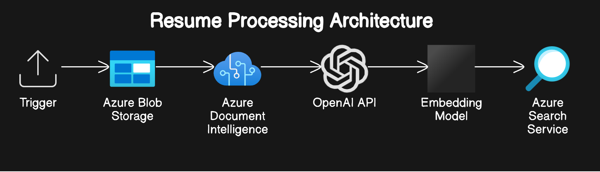

# Azure Function for Document Processing
This Azure Function is designed specifically to handle the processing of document uploaded to Azure Blob Storage. It utilizes AI Document Intelligence to extract and analyze the document content, and OpenAI's text classification capabilities to categorize the extracted text. To enhance the processing, an embedding model is used to convert the classified text into vector data. The vector data is then seamlessly integrated into Azure Search Service for efficient indexing and searching.

## Expected input and output
- **Input**: User uploads a document to Azure Blob Storage.
  - The document can be in various formats such as PDF, Word, or text.
  - The user needs to have appropriate permissions to upload the document.
  - The document is stored securely in the cloud.

- **Processing**: The document processing trigger by Azure function.
  
- **Output**: The document is then uploaded to Azure AI Search with key skills.
  - The document becomes searchable within the Azure AI Search service.
  - Users can search for the document using keywords and filters.
  - The search results highlight the key skills and information extracted from the document.

## Table of Contents
- Prerequisites
- Architecture
- Setup
- Function Code
- Deployment
- Usage
- Contributing
- License

## Prerequisites
- Azure Subscription
- Python 3.8 or later
- Azure CLI
- Azure Functions Core Tools
- Azure Storage Account
- Azure Cognitive Services (Document Intelligence)
- OpenAI API Key
- Azure Search Service
- Create manage identity between Blob storage and Document intelligence

## Architecture
1. **Trigger**: The function is triggered when a document is uploaded to Azure Blob Storage.
2. **Document Intelligence**: The content of the document is read using Azure Document Intelligence.
3. **Text Classification**: The text is classified using OpenAI's API.
4. **Embedding Model**: The classified text is converted into vector data using an embedding model.
5. **Azure Search**: The vector data is loaded into Azure Search Service for indexing and searching.


## Setup

### 1. Clone the Repository
```bash
git https://github.com/mishravivek-ms/azfunction_openai_documentupload_aisearch_python.git

```


### 2. Setup Environment variable
1. Create a file name ".env".
2. Copy content from example.env to .env file.
3. Create a Cognitive Service for Form Recognizer.
4. Create Azure OPEN AI services. 
5. Create a storage account for upload document. 
6. Create Azure search services


### 3. Code details 
#### 1: Verify the availability of the Azure service index. If the index is not available, create it.
```bash
    try:
        # Try to get the index
        search_index_client.get_index(ai_search_index)
        # If no exception is raised, the index exists and we return
        print("Index already exists")
        return
    except:
        # If an exception is raised, the index does not exist and we continue with the logic to create it
        pass
    ........
    ........
    ........
        #Create index
    index = SearchIndex(name=ai_search_index, fields=fields,
                    vector_search=vector_search)
    result = search_index_client.create_or_update_index(index)
```

##### 2. Retrieve the PDF from the file stored in BLOB storage, and utilize Document Intelligence to extract text and file content according to a predefined layout.
```bash
    blob_url = f"https://{storage_account_name}.blob.core.windows.net/{input_file}"
    analyze_request = {
        "urlSource": blob_url
    }
    poller = document_intelligence_client.begin_analyze_document("prebuilt-layout", analyze_request=analyze_request)
    result: AnalyzeResult = poller.result()
    #print(result.content)
    
    

    #read result object into a full text variable
    full_text = result.content

```
##### 3. Use OpenAI for extract the required item based in prompt. This code snippet a part of a function that interacts with a language model to process some text and extract information in JSON format.
```bash
    messages = [{"role": "system", "content": resume_indexing_prompt}]
    messages.append({"role": "user", "content": full_text})

    response = primary_llm_json.invoke(messages)
    extraction_json = json.loads(response.content)
```

##### 4. Application use the JSON data for invoke embeddings model (text-embedding-ada-002) and create a indexed record. 


##### 5. Upload the JSON data and indexed record into Azure search services. 
```bash
            document = {
                "id": document_id,
                "date": current_date,
                "jobTitle": jobTitle,
                "experienceLevel": experienceLevel,
                "content": full_text,
                "sourceFileName": fileName,
                "searchVector": searchVector
            }
            
            search_client.upload_documents(documents=[document])
```
##### 6. Move the uploaded blob document into processed or archive folder. 
